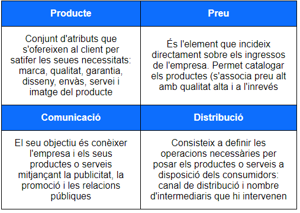
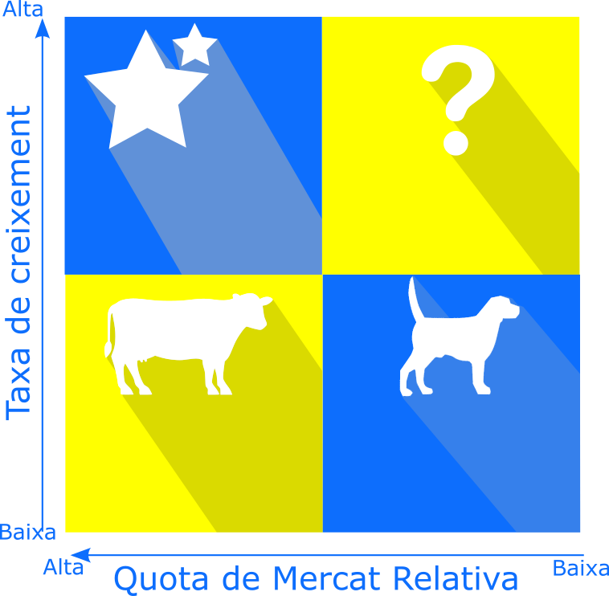
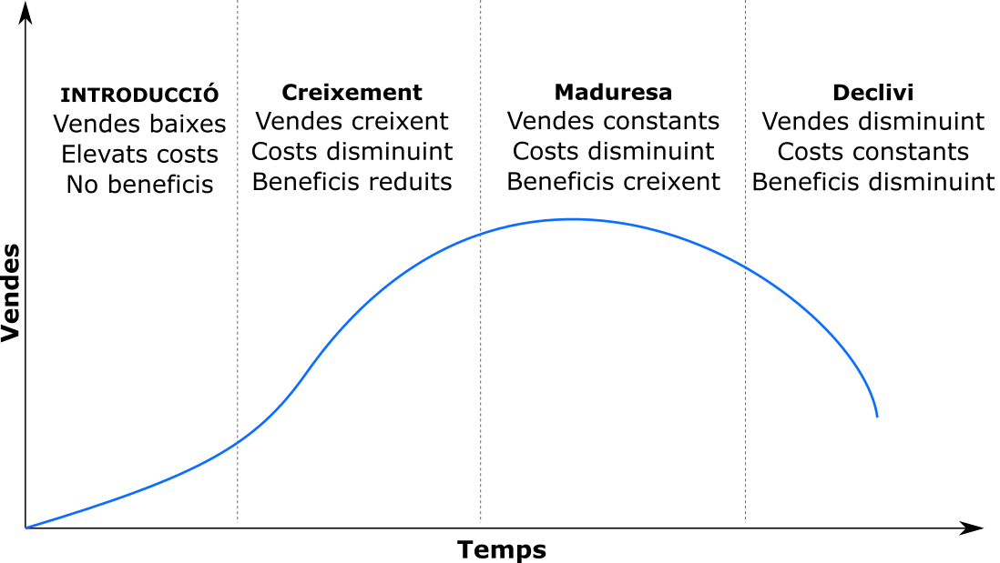
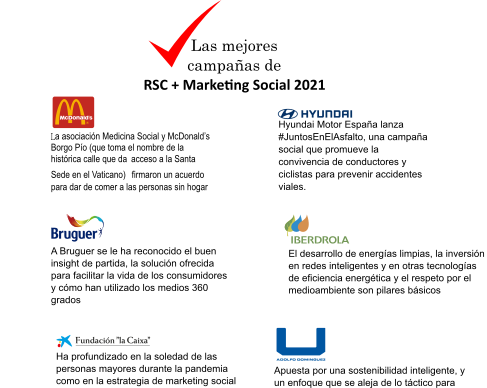

--- 
title: "UNITAT 3: LLANÇAMENT DE L'EMPRESA AL MERCAT"
author: "Fernando Verdú Primo"
date: "`r Sys.Date()`"
output: pdf_document
template: template.tex
documentclass: book
toc-title: "Continguts de la Unitat"
bibliography:
- book.bib
- packages.bib
cover-image: cover.svg
biblio-style: apalike
csl: chicago-fullnote-bibliography.csl
site: bookdown::bookdown_site
---


# 3 Llançament de l'empresa al mercat{-}

En aquesta unitat realitzarem les activitats necessàries per a donar a conèixer l'empresa Marmingo LLum SL a la clientela potencial que s'haurà definit prèviament.


## 3.1 Conceptes bàsics{-}

### A. L'empresa i el seu entorn{-}

Una empresa no és un element aïllat, sino que està immersa dins un mercat: un conjunt de fets i factors externs que condicionen la seua activitat. Per analitzar el mercat, podem distingir entre entorn general i entorn específic.

- L'entorn general està format pels factors económics, socials, demogràfics, polítics i tecnològics que afecten a totes les empreses, amb independència del sector o activitat al que pertanyen.

- L'entorn específic de l'empresa està format pels factors que afecten a aquesta de forma directa en funció del sector al que pertany: clientela, empreses proveïdores i competidores, tant actuals com potencials.


### B. Anàlisi del sector i la competència{-}
Per realitzar una anàlisi sectorial, s'ha de buscar informació. Algunes fonts d'informació útils són: les associacions sectorials, les organitzacions patronals sectorials, els sindicats de les corresponents rames d'activitat, els estudis sectorials realitzats per les cambres de comerç, les revistes especialitzades, les monografies de la premsa diària, les empreses consultores, etc.

És important conèixer quines empreses composen la nostra competència, quantes són, el seu tamany, volum de vendes, quotes de mercat i evolució (tendència, índex de creixement, distribució geogràfica, etc).

El coneixement del sector permetrà a l'empresa organitzar campanyes que la diferencien de la resta de competidors. Una ferramenta molt útil per conèixer i analitzar la competència és l'anàlisi DAFO (debilitats, amenaces, fortaleces i oportunitats)


### C. Estudi del mercat: els clients{-}

Conèixer el mercat i el tipus de clients és una informació de gran ajuda per a l'èxit dels productes o serveis que ofereix l'empresa. És fonamental realitzar un estudi de mercat per a conèixer el perfil i el comportament de la clientela objectiu, determinar el tamany actual i futur del mercat i anticipar les reaccions de la competència. L'empresa haurà d'establir a quins clients es dirigeix, quines necessitats vol satisfer i com el producte o servei satisfarà eixa necessitat.

La investigació de mercat es pot realitzar a través de diverses maneres:

- *Observació directa:* pot realitzar-se en la propia empresa o en estableiments de la competència, observant les característiques de cada tipus de client, els productes més demanats o les motivacions de compra. Es pot realitzar també la tècnica del cliente misteriós (mystery shopping), que permet conèixer la qualitat del servei que s'ofereix.

- *Entrevistes i enquestes:* amb aquestes tècniques s'obtindran dades de la clientela objectiu, així com del seu comportament: característiques demogràfiques i socieconòmiques, opinió dels productes oferits per l'empresa, grau de coneixement d'aquestos, intenció de compra, etc.

Una vegada realitzat l'estudi de mercat, l'empresa haurà de disenyar *un pla de marketing* en el que s'establisquen decisions referents al producte o servei que es va a oferir, el seu preu i l'estratègia de comunicació, marketing on-line i distribució comercial.

### D. Pla de marketing{-}

El *marketing* és el conjunt de tècniques utilitzades per a aconseguir el màxim benefici amb la venda d'un producte i la satisfacció del client. Per a que puguen asolir-se els objectius plantejats pel marketing, hi ha quatre variables que representen la política comercial de la empresa: producte, preu, comunicació i distribució.


```{r,eval=TRUE, echo=FALSE, fig.cap="Elements del pla de marketing"}

```


### E. La publicitat{-}

És el mitjà que utilitza l'empresa per donar a conèixer els seus productes a la clientela potencial i influir en les seues decisions de compra.


```{r, fig.cap='Característiques del tipus de publicitat', eval=TRUE, echo=FALSE}
knitr::include_graphics('tablaPublicitat.png')
```


S'han de definir els objectius que es pretenen aconseguir amb la publicitat, qui són els destinataris i quins mitjans publicitaris s'utilitzaran.


### F. La promoció{-}

L'objectiu de la promoció d'un producte és aconseguir un increment de les vendes  a curt termini i en un temps limitat. A més, permet atreure nous consumidors, compensar l'estacionalitat del producte, eliminar o disminuir l'estoc, introudir un nou producte o respondre davant de la competència.

Els principals instruments promocionals són: descomptes, unitats bonificades, regals promocionals, consursos, sortejos de viatges, etc.

És important estudiar la incidència que la promoció realitzada ha tingut en les vendes per poder determinar-ne l'efectivitat i, si escau, establir les correccions oportunes en promocions posteriors.

### G. Publicitat en el lloc de venda: el marxandatge{-}

El marxandatge consisteix a aplicar tècniques comercials al punt de venda dirigides a incrementar les vendes, motivar l'acte de compra i satisfer les necessitats del consumidor.

Els principals elements del marxandatge són: l'aparador, la cartelleria (cartells penjants, suports, indicadors d'oferta o promoció), la il·luminació (destinada a destacar exposats i a decorar la botiga aportant calidesa i bon ambient), la decoració (coherent amb la imatge que es vol projectar),  la col·locació dels productes (góndoles, displays i expositors) i l'atenció al client (s'ha d'oferir professionalitat, amabilitat i rapidesa).

### H. La fidelització{-}

Per a les empreses és important convertir la clientela esporàdica en clientela habitual mitjançant diverses estratègies de fidelització. Algunes de les més utilitzades són: aplicació de descomptes exclusius, rebaixes anticipades per a socis i sòcies, targetes client, regals exclusius a l'aniversari, ofertes personalitzades i enviament de newsletters, entre altres.

## 3.2 Anàlisi de la cartera producte-mercat BCG{-}

Per analitzar la competència, l'empresa d'assessorament empresarial Boston Consulting Group (BCG) va desenvolupar un mètode senzill.

Es representa mitjançant una matriu on es cataloguen els productes en funció de dos paràmetres: la taxa de creixement del merxcat i la participació relativa o quota de mercat relativa.

La taxa de creixement es representa al eix de ordenades Y, al que es reflexa el increment de les vendes d'un determinat producte en u periode anual. La participació o quota de mercat relativa es representa a l'eix absices X. S'ha de tenir en compte que l'eix es representa en sentit decreixent.

Com a línia vertical es fa referència al valor 1 per a la variable quota de mercat relativa. 

Com a línia horitzontal es fa referència al valor que ve representat pel creixement global del mercat (taxa de creixement global).

De la intersecció d'ambdues rectes sobté un pla dividit en quatre zones, tal com s'indica al gràfic:

```{r, out.width='50%', fig.align='center', fig.cap='Matriu de la BCG', echo=FALSE}

```

Els *productes estrella* tenen una taxa de creixement elevada i quota de mercat alta: els beneficis que s'obtenen es reinverteixen amb la finalitat de consolidar la seua quota de mercat i el seu creixement. 

Els *productes vaca* tenen una taxa de creixement baixa i quota de mercat alta: no requereix  grans inversions; els beneficis que aporten financien el creixement d'altres productes. Són productes coneguts al seu mercat i s'inverteix per mantindre la seua quota.

Els *productes gos* presenten un creixement baix i una quota de mercat baixa: la seua rendibilitat es baixa i no generen liquiditat: són productes que no han culminat la fase de creixement o que no han finalitzat la fase de vaca. No interessa invertir en ells atés que és molt difícil rellançar-los.

Els *productes interrogant* presenten una taxa de creixement alta i quota de mercat baixa: s'han de realitzar grans inversions amb la finalitat de mantenir la quota de mercat o augmentar-la. Aquestos productes aporten pocs beneficis.

Per a representar la matriu de l'anàlisi BCG es necessari conèixer com es calculen la quota de marcat, la taxa de creixement i la quota de mercat relativa. S'utilitzen les fórmules següents:

$$\begin{equation} 
\begin{split}
\mbox{Quota de mercat}=\frac{\mbox{Vendes del producte}}{\mbox{Vendes Totals}} * 100
\end{split}
\end{equation} $$


$$ \begin{equation}
\mbox{Quota de creixement}=\frac{Vendes_{n}-Vendes_{n-1}}{Vendes_{n-1}}*100
\end{equation}
$$

$$
\mbox{Quota de mercat Relativa}=\frac{\mbox{Quota de Mercat del producte}}{\mbox{Quota de Mercat competidor líder}}
$$

## 3.3 Cicle de vida de l'empresa{-}

El cicle de vida empresarial  és el procés de canvi en una empresa a través del temps mitjançant la incorporació de nous processos de negoci , noves tecnologies , i noves capacitats, igual que el manteniment, la disposició i disponibilitat d'elements existents a l'empresa.

Si observem l'actuació de les empreses al mercat, arribem a la conclusió de que el comportament s'assembla al dels éssers vius, és a dir, presenten un cicle vital: naixen, creixen, es desenvolupen i moren.

```{r, echo=FALSE, out.width="100%", fig.cap="Cicle de vida de l'empresa"}

```

Afirmar que una empresa té un cicle de vida implica tenir en compte aquestos aspectes:

- Les empreses tenen una existència limitada
- Les vendes de qualsevol producte passa per diferents etapes, cadascuna suposa un desafiament per a l'empresa que el produeix
- Els beneficis experimenten oscilacions depenent de l'etapa del cicle en que es trobe el producte.
- En cada etapa s'hauran d'aplicar diferents estratègies, tant de marketing, personal, financeres, aprovisionament, etc.


La forma de la curva del cicle de vida de l'empresa depen del tipus de producte i de la seua evolució al mercat, tot i que el factor que serveix per a identificar la fase sol ser el de vendes. Tanmateix, la duració de les etapes ha de revisar-se periòdicament per a defendre la permanència del producte en cada una de les fases davant els atacs de la competència.

## 3.4 La responsabilitat social corporativa i la publicitat{-}

Les pràctiques de responsabilitat social corporativa són una tendència actual entre les empreses perquè enforteixen la marca. A més, donar a conèixer mitjançant la publicitat l'impacte possitiu que tenen en la societat és útil per atraure a nous consumidors i consumidores.

Per altra banda, la responsabilitat social corporativa també resulta adequada atés que qualsevol consumidor té tendència a exigir cada vegada més que hi haja una major transparència en les activitats que porten a terme les empreses.

```{r, echo=FALSE, out.width="100%", fig.cap="Marketing Social 2021"}

```